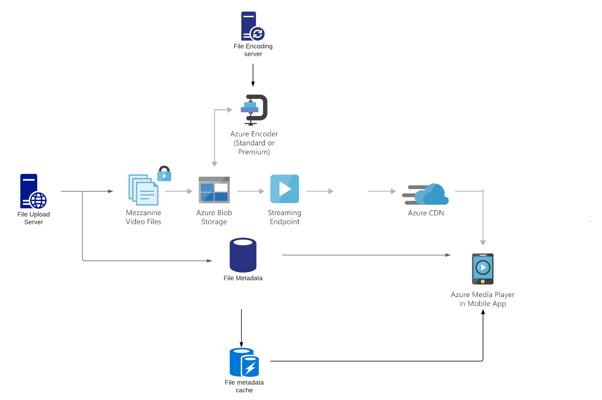
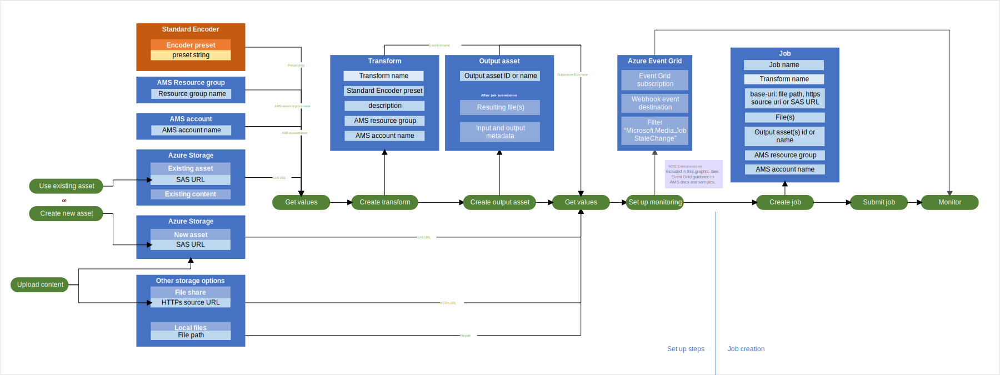

# CloudVOD

## Table of contents

* [Azure Architecture](#azure-architecture)
* [Encoding Workflow](#encoding-workflow)
* [Instructions to run & test](#instructions-to-run--test)
* [Links](#links)

## Azure Architecture 

This is the cloud architecture diagram that we customized ourselves for the CloudVOD platform

## Encoding Workflow

This diagram details the process of uploading, encoding, and monitoring

## Instructions to run & test

1. Create a Microsoft Azure Account & create the Azure Media Service resource via setup wizard
2. Run `npm install` in root dir
3. Create a `.env` file based on `.env.example` in repo & replace values with azure account info
4. Run `npm run watch` in root dir
5. Go to `http://localhost:5000/api/az/file-uploader` in a web browser and upload a video file 

## Links

* [CS 398 Project Breakdown & Schedule](https://docs.google.com/document/d/1TPW5O2suvk0QhPRj9qDWTAZpsLD9Q4VAowbPcxPaejY/edit)
* [Document of learnings, experiences, and possible topics for the final report](https://docs.google.com/document/d/1k7a-R2npgfwyxpXZXpCXmq1LcAA_Dwydnfnx_EMB630/edit)
